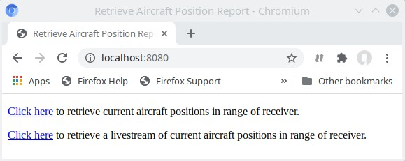
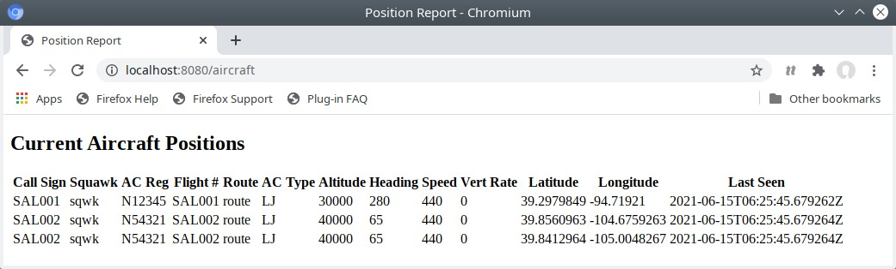
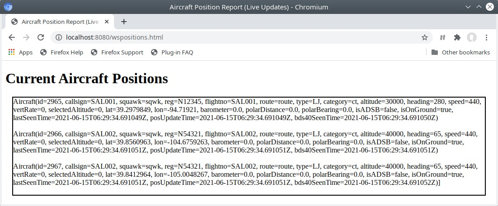

# aircraft-positions
Aircraft positions project from Spring Boot Up &amp; Running book that queries the PlaneFinder service and stores received data in an embedded.

It serves two web pages that display the aircraft positions: a template based webpage that uses Thymeleaf and a static webpage that uses websockets and JavaScript to display aircraft positions.

## Usage

The *aircraft-positions* service will connect to the [planefinder](https://github.com/mthaler/planefinder) service to receive aircraft locations, thus the *planefinder* service needs to be started first.

Open http://localhost:8080 with a browser:

The first link will show a template based webpage that uses Thymeleaf:

The second link will show a webpage that uses websockets and is updated in real-time:

